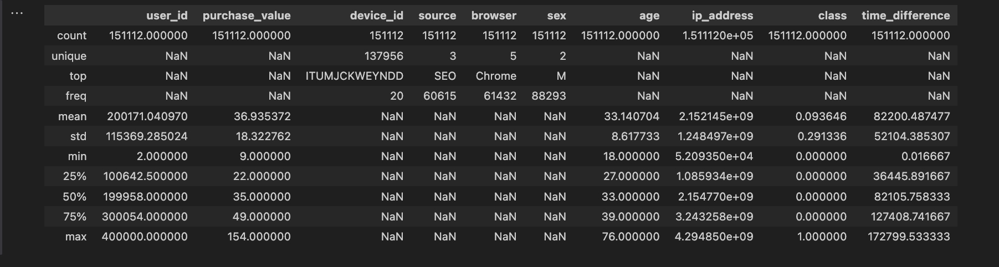

# Capstone-Miller
## E-Commerce Fraud Detection Model

## Description
The goal of this project is to create a model that can predict fraudulent E-Commerce credit card transactions. The project utilizes simulated credit card data to explore the ability of machine learning to identify fraudulent E-Commerce credit card transactions. Success in this project could suggest that machine learning can be used to identify E-Commerce fraud, and could be used to save businesses and individuals from significant financial loss. 

## Project start
1. Start a new repository and select default README.md
2. Clone the repository to local environment. I Used VS Code to clone the repository. 
3. Open the project, create, and activate the virtual environment
```bash
python3 -m venv .venv
source .venv/bin/activate
```
4. Install dependencies into the .venv
```bash
python3 -m pip install pandas scikit-learn seaborn matplotlib
```
5. Freeze dependencies into requirements.txt
 ```bash
 python3 -m pip freeze > requirements.txt
  ```
## Project Introduction
E-Commerce has experienced great growth over the last several years as a result
of accessibility and convenience, especially during pandemic lockdowns [4]. How-
ever, the growth of E-Commerce has also led to the growth of E-Commerce fraud.
E-Commerce fraud refers to unauthorized activity that exploits on-line shopping
platforms and payments where fraudsters have access to personal information
and make financial gains [5]. According to Juniper Research, E-Commerce fraud
is expected to increase from $44.3 billion in 2024 to $107 billion in 2029 [6].
Types of E-Commerce fraud include card-not-present fraud, stolen credit card
fraud, friendly fraud, identity fraud, card testing fraud, refund abuse, and trian-
gulation fraud [1]. Fraudulent transactions are harmful both to businesses and
individuals, as they can lead to significant financial losses.
Detecting and stopping E-Commerce fraud is crucial as E-Commerce con-
tinues to grow. Machine learning can be used to analyze data, identify pat-
terns, and adapt to trends to improve fraud detection [2]. This study aims to
develop a model that correctly identifies card-not-present fraud in the Kaggle
dataset, https://www.kaggle.com/datasets/vbinh002/fraud-ecommerce/data, of
simulated E-Commerce transactions, as real transactions cannot be used due to
privacy issues

## Project Implementation Steps
1. Introduce the problem and define the objective
(a) Introduction and Goals
(b) Project Limitations
2. Data Collection
(a) Data Source
(b) Data Description
(c) Data Attributes
3. Prepare Data
(a) Data Cleaning
(b) Feature Engineering
4. Conduct exploratory data analysis (EDA).
(a) Descriptive Statistics
(b) Initial Visualization
5. Select, train, and evaluate models
(a) Select Models
(b) Train Models
(c) Evaluate and Compare Models
6. Results and Conclusions
(a) Interpretation of Results
(b) Conclusions and Insights

## Goals
1. Ensure the use of clean data and create a new feature to better evaluate the
data.
2. Analyze fraudulent transactions to determine which features predict fraud
with the highest precision and accuracy.
3. Evaluate multiple models to determine which model best predicts fraudulent
E-Commerce transactions.
## Limitations
– Use of Simulated Data: Simulated data is used to protect the privacy of
customers. Simulated data can lack complexity and may show bias, so it
would not be as affective as real data.
– Generalization or Overfitting: The simulated data is generalized to one type
of fraudulent transaction, card-not-present fraud, and would likely struggle
to identify other types of fraud. The simulated data could also be based on
previous fraud patterns, so as new fraud patterns emerge, the model would
be less effective in detecting fraud.
## Data Collection
### Data Source and Description
The E-Commerce Fraud data set, found here https://www.kaggle.com/datasets/vbinh002/fraud-ecommerce/data, 
is a Kaggle dataset and contains simulated credit card transactions where fraudulent 
transactions are scattered through-out the data set. The data contains simulated
transactions from 01/01/2015 to 12/16/2015 from different browsers, sources, and 
IP addresses. The data set is a 16.1 MB structured data set that contains 151,112 rows and 11 columns. 
Thedata set is very clean and contains no missing or duplicate values, making it
suitable for analysis.
### Data Collection
The data set was downloaded directly from Kaggle in CSV format. Once down-
loaded, the data set was placed in the correct folder for work within VS Code,
saved in VS Code, and then pushed to GitHub. The process did not require any
special scraping or data extraction techniques.
### Data Dictionary
| Column Name      | Description                             | Data Type | Example Value        |
|------------------|-----------------------------------------|-----------|----------------------|
| Age              | Age of the user                        | int64     | 39                   |
| Browser          | Browser used                            | object    | Chrome               |
| Class            | Fraud label (0 or 1)                   | int64     | 0                    |
| Device ID        | Unique device identifier               | object    | QVPSPJUOCKZAR        |
| IP Address       | IP address used during transaction     | float64   | 732758368.79972      |
| Purchase Time    | Time of Initial Purchase               | object    | 2015-04-18 02:47:11  |
| Purchase Value   | Value of the purchase transaction      | int64     | 34.00                |
| Sex              | Gender of the user                     | object    | M                    |
| Signup Time      | Time of Initial Signup                 | object    | 2015-02-24 22:55:49  |
| Source           | Source of traffic                      | object    | SEO                  |
| User ID          | Unique identifier for each user        | int64     | 22058                |
## Clean and Process Data
### Data Cleaning and Feature Engineering
A Jupyter Notebook within VS Code was used to check the data for any nec-
essary cleaning. The Pandas library was then used to check for missing or du-
plicated values. There were no duplicated or missing records in the dataset, so
these issues did not need to be addressed. Pandas was also used to check the
data type of each column to ensure that each column had the correct data type.
The columns signup time and purchase time were object data type and had
to be converted to date-time data type.
### Feature Engineering
Once signup time and purchase time were converted to date-time data, fea-
ture engineering was used to create a new column for analysis. For the new
column, signup time time was subtracted from purchase time to represent the
time between sign-up and initial purchase. This new column could help identify
fraudulent purchases where there is little time between the sign-up time and the
initial purchase time. This new column eliminates the need for the signup time
and purchase time columns, so Pandas was used to drop both columns from
the dataset. The cleaned and transformed data set was then saved as a new CSV
using Pandas.
### Cleaned and Feature Engineered Data Dictionary
In the cleaned dataset, columns user id, purchase value, device id, source,
browser, sex, age, ip address, and time difference will be independent vari-
ables. The column class, that classifies a transaction as fraudulent or non-
fraudulent, is the dependent variable.
| Column Name      | Description                                    | Data Type | Example Value        |
|------------------|------------------------------------------------|-----------|----------------------|
| User ID          | Unique identifier for each user               | int64     | 22058                |
| Purchase Value   | Value of the purchase transaction              | int64     | 34.00                |
| Device ID        | Unique device identifier                       | object    | QVPSPJUOCKZAR        |
| Source           | Source of traffic                              | object    | SEO                  |
| Browser          | Browser used                                    | object    | Chrome               |
| Sex              | Gender of the user                             | object    | M                    |
| Age              | Age of the user                                | int64     | 39                   |
| IP Address       | IP address used during transaction             | float64   | 732758368.79972      |
| Time Difference  | Time Between Sign-up and Purchase (Minutes)    | float64   | 75391.4              |
| Class            | Fraud label (0 or 1)                           | int64     | 0                    |
## Exploratory Data Analysis
Exploratory Data Analysis is an important part of a data analytics project [3].
EDA can be used to identify patterns, anomalies, relationships, and insights
from the data [3]. Unlike other methods that are used to confirm a hypothesis,
EDA allows you to generate new hypotheses from the data [3]. EDA ensures
that data are objectively assessed and can be used to thoroughly describe data
before performing more complex analyses [3]. EDA in the early stages of a project
can ensure the quality of the data and help fit the data to the correct model,
maximizing potential insights [3]

EDA for the project was performed in a Jupyter notebook within VS Code,
and the notebooks can be found here https://github.com/gmill88/Capstone-Miller/
blob/main/EcommerceFraudEDA.ipynb. The cleaned data set was first loaded
into the notebook; then important Python libraries such as pandas, seaborn,
matplotlib, and scikit-learn were imported. Commands like head(), .shape, and
info() were used to inspect the cleaned data. These commands provide a quick
look at the first few rows of data, the number of rows and columns in the dataset,
the number of non-null rows, and the datatype of each row in the data. These
commands revealed that there are 10 columns and 151,112 rows in the cleaned
data, and all rows contain non-null data (no missing values). After inspection,
describe(include=’all’) was used to generate summary statistics for numerical
columns and frequency statistics for the categorical columns. A bar graph was
used to inspect the distribution of class throughout the dataset, as class is the
variable the model will attempt to predict. Box plots, bar graphs, and vio-
lin graphs were then used to inspect the relationship of the class with other
columns like purchase value, source, browser, sex, and time difference.
A correlation heat map was then used to inspect the correlation between age,
class, purchase value, time difference, and class in an attempt to deter-
mine how correlated these variables were and if there were any strong correlations
to avoid when creating a model.
### Descriptive Statistics


Figure 1: E-Commerce Fraud Dataset Descriptive Statistics

